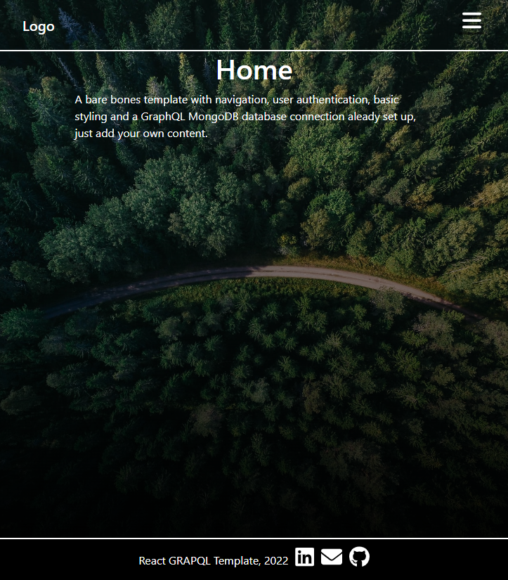

# React GraphQL Template

[](https://choosealicense.com/licenses/mit/)

[](https://github.com/HobbaZ/React-Graphql-Template/commits)
[](https://github.com/HobbaZ/React-Graphql-Template/branches)
[]()

[](https://img.shields.io/github/issues/HobbaZ/React-Graphql-Template)


## Description
### Project Aim ###
To create a simple React app with GraphQL MongoDB database to be used as a template to develop websites quicker.

### What Problem Does It Solve ###
Starting a React website from scratch

### What I Learnt ###
How to use GraphQL with React

## Deployment
Not deployed yet, will be deployed on Heroku


## Table of Contents
- [Description](#description)
- [User Story](#user-story)
- [Screenshots](#screenshots)
- [Installation](#installation)
- [Features](#features)
- [Technology](#technology)
- [Contributors](#contributors)
- [Acknowledgements](#acknowledgements)
- [Testing](#testing)
- [License](#license)
- [Questions](#questions)

## User Story
Create a template for basic setup of a React SPA with a GraphQL backend.

## Screenshots



## Installation
1. Clone the repo to your computer by clicking the green code button and copying the SSH version.

2. Open Gitbash in your desired folder and type ```git clone ``` then right click to paste the string and hit enter. The repo will then be cloned to your computer.

3. Navigate to the repo folder and type ```code .``` into gitbash to open the repo in VS Code.

4. Open a new Terminal in VS Code and type ```npm install``` to install the repo dependencies.

5. Create a .env file like the image below in the server folder and input your database details.


6. Install concurrently as dev dependency ```npm i concurrently -D``` at root folder

7. Finally, type ```npm run develop``` into the terminal and it will start the dev server at localhost:3000.

## Features
- Can create an account, delete your account and update your details.
- User Authentication for profile and login routes.
- Login, signup, home, profile, about and contact pages.
- Express server already set up and ready to go.
- MongoDB database ready, change details in .env file to connect yours.
- Fontawesome icons used where appropriate.

## Technology
- Express
- Heroku 
- GraphQL
- React
- JWT
- MongoDB
- Bootstrap

## Contributors
[Zachary Hobba](https://github.com/HobbaZ)

You can also contribute by opening a pull request or submitting an issue.

## Acknowledgements
Background photo is by [Geran de Klerk](https://unsplash.com/@gerandeklerk?utm_source=unsplash&utm_medium=referral&utm_content=creditCopyText) [forest](https://unsplash.com/s/photos/forest?utm_source=unsplash&utm_medium=referral&utm_content=creditCopyText)

Important: Code to kill port processes if something running on port 3000 error ```npx kill-port 3000```, type into your VS Code terminal and hit enter, will kill port 3000 and let you run the app.

## Testing
No tests yet

## License

MIT

**Copyright 2022 Zachary Hobba**

Permission is hereby granted, free of charge, to any person obtaining a copy of this software and associated documentation files (the "Software"), to deal in the Software without restriction, including without limitation the rights to use, copy, modify, merge, publish, distribute, sublicense, and/or sell copies of the Software, and to permit persons to whom the Software is furnished to do so, subject to the following conditions:
The above copyright notice and this permission notice shall be included in all copies or substantial portions of the Software.
    
THE SOFTWARE IS PROVIDED "AS IS", WITHOUT WARRANTY OF ANY KIND, EXPRESS OR IMPLIED, INCLUDING BUT NOT LIMITED TO THE WARRANTIES OF MERCHANTABILITY, FITNESS FOR A PARTICULAR PURPOSE AND NONINFRINGEMENT. IN NO EVENT SHALL THE AUTHORS OR COPYRIGHT HOLDERS BE LIABLE FOR ANY CLAIM, DAMAGES OR OTHER LIABILITY, WHETHER IN AN ACTION OF CONTRACT, TORT OR OTHERWISE, ARISING FROM, OUT OF OR IN CONNECTION WITH THE SOFTWARE OR THE USE OR OTHER DEALINGS IN THE SOFTWARE.

## Questions

Find me on Github at [HobbaZ](https://github.com/HobbaZ)

If this has helped you with your web development, consider buying me a Coffee (only costs $3) at [zachobba](buymeacoffee.com/zachobbaS)

Email me at [zachobba@gmail.com](zachobba@gmail.com)